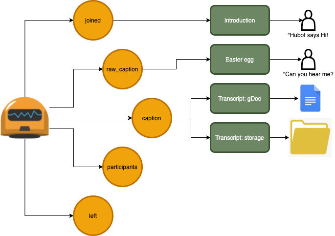

# Meetbot 

Meetbot will listen to google meet urls to join to and perform various tasks.

By default since the bot isn't authenticated it will prompt people in the meet to allow the bot to join.



## Development

After cloning the repository install the dependencies:

```
npm ci
```

## Running the bot 

```
npm start
```

The bot will now be running but functionality is limited until you add additional configurations for [authentication](#authentication).

To get a bot to join a meet send a POST request to the join endpoint with the meet url like:

```
curl --header "Content-Type: application/json" \
  --request POST \
  --data '{"url":"https://meet.google.com/wtq-bhai-amg"}' \
  http://localhost:8080/join
```

## Authentication

Copy `.env.example` to `.env` and populate it with the correct information. This is used by the bot to login to accounts.google.com.

Finally, for integrations with Google docs and calendar you must download the credentials file containing data for oauth2 flow. This is used to authenticate requests to the Google API. See the following docs to create the credentials needed:

- Step 1: https://developers.google.com/workspace/guides/create-project
- Step 2: https://developers.google.com/workspace/guides/create-credentials#desktop
- Step 3: At the end of the process, download the JSON file and place it at the root of the project directory with name as "credentials.json".

Troubleshooting: https://stackoverflow.com/questions/58460476/where-to-find-credentials-json-for-google-api-client

Run the command below and follow the instructions to generate a `token.json` file. This authentication process is one time only and after this the token.json file will be used for all authentication process. 

```
ts-node src/google/create-token.ts
```

## Deployment

Before deployment, create an `.env` file using the available `.env.example` file in the repository with the descriptions as mentioned below:

```
GOOGLE_PASSWORD=              # Password for your bot/user that is used to join Google Meet. 
GOOGLE_TOTP_SECRET=           # [Optional] If the bot account has 2FA auth, then add 2FA secret here.
GOOGLE_LOGIN=                 # Email-ID/username of your bot/user
TOKEN_PATH=token.json         # [Default] Path to token file 
HTTP_PORT=80                  # Port to run express server on. For prod, use port 80.
RUNNING_ALPINE=0              # [Default] If base image is alpine then set the env var, otherwise don't. 
```

Run the command below and follow the instructions to generate a `token.json` file. This authentication process is one time only and after this the token.json file will be used for all authentication process. 

```
ts-node src/google/create-token.ts
```

To deploy on balenaCloud, run the command:

```
balena push <Name of fleet>
```
